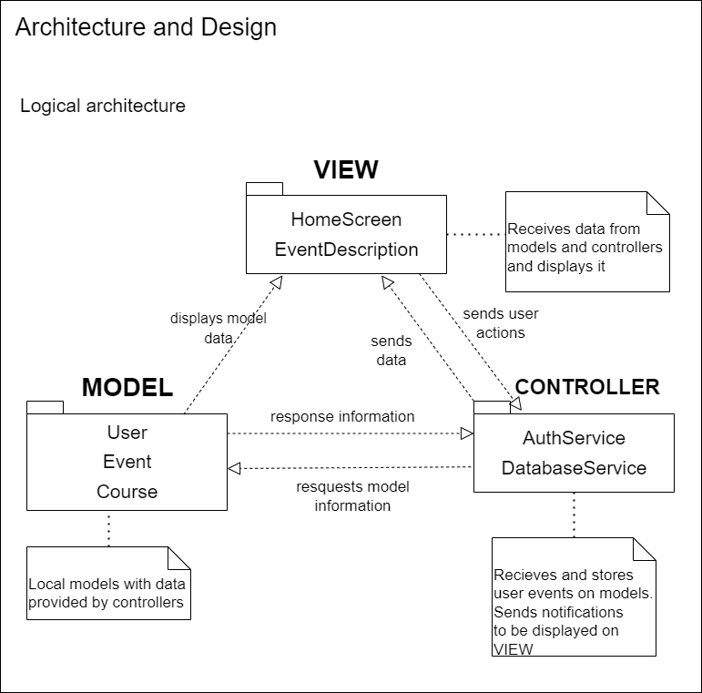

## Architecture and Design

### Logical Architecture
This project's logical architecture follows the Model-View-Controller Pattern (MVC).

* The Model stores all the data from RemindMeUP such as tasks with associated
  time, location and description.

* The View displays the app information state, i.e , login, task and create pages.

* The Controller mediates the events requested by the user and sends the appropriate notifications to
  be displayed, i.e, when the user creates a new task the controller is responsible for making the data
  ready to be displayed.

### Physical Architecture

In this project we opted to use the cloud functions provided by [Firebase](https://firebase.google.com/), a serverless framework that allows us to run backend code that triggers events for the notification service (Firebase Cloud Messaging). These functions will also allow us to use FireStore, a realtime Database, keeping our data in sync across our clients applications through realtime listeners and also offering offline support for our mobile and web so we can build responsive apps that work regarless of network latency and Internet availability.

### Vertical Prototype

To help on validating all the architectural, design and technological decisions made, we usually implement a vertical prototype, a thin vertical slice of the system. 

In this subsection please describe which feature you have implemented, and how, together with a snapshot of the user interface, if applicable.

At this phase, instead of a complete user story, you can simply implement a feature that demonstrates thay you can use the technology, for example, show a screen with the app credits (name and authors).

