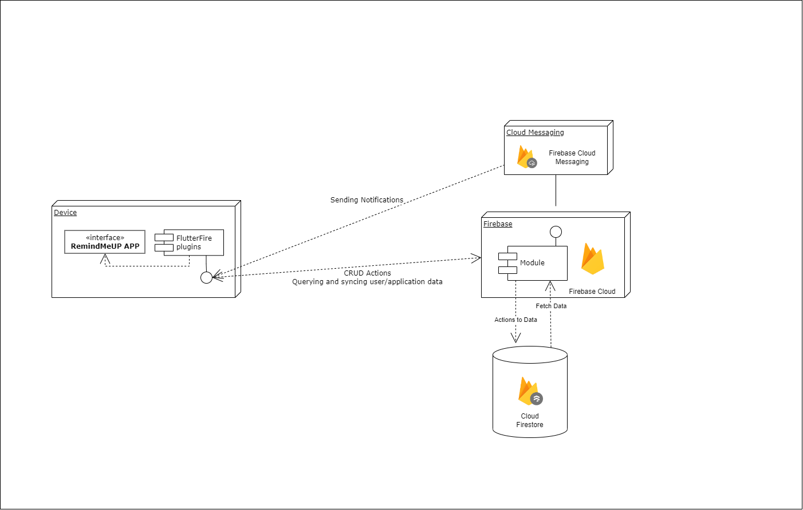

## Architecture and Design
The architecture of a software system encompasses the set of key decisions about its overall organization. 

A well written architecture document is brief but reduces the amount of time it takes new programmers to a project to understand the code to feel able to make modifications and enhancements.

To document the architecture requires describing the decomposition of the system in their parts (high-level components) and the key behaviors and collaborations between them. 

In this section you should start by briefly describing the overall components of the project and their interrelations. You should also describe how you solved typical problems you may have encountered, pointing to well-known architectural and design patterns, if applicable.

### Logical Architecture
The purpose of this subsection is to document the high-level logical structure of the code (Logical View), using a UML diagram with logical packages, without the worry of allocating to components, processes or machines.

It can be beneficial to present the system both in a horizontal or vertical decomposition:
* horizontal decomposition may define layers and implementation concepts, such as the user interface, business logic and concepts; 
* vertical decomposition can define a hierarchy of subsystems that cover all layers of implementation.

Example of _UML package diagram_ showing a _logical view_ of the Eletronic Ticketing System (to be accompanied by a short description of each package):

### Physical Architecture

In this project we opted to use the cloud functions provided by [Firebase](https://firebase.google.com/), a serverless framework that allows us to run backend code that triggers events for the notification service (Firebase Cloud Messaging). These functions will also allow us to use FireStore, a realtime Database, keeping our data in sync across our clients applications through realtime listeners and also offering offline support for our mobile and web so we can build responsive apps that work regarless of network latency and Internet availability.

### Vertical Prototype

To help on validating all the architectural, design and technological decisions made, we usually implement a vertical prototype, a thin vertical slice of the system. 

In this subsection please describe which feature you have implemented, and how, together with a snapshot of the user interface, if applicable.

At this phase, instead of a complete user story, you can simply implement a feature that demonstrates thay you can use the technology, for example, show a screen with the app credits (name and authors).

