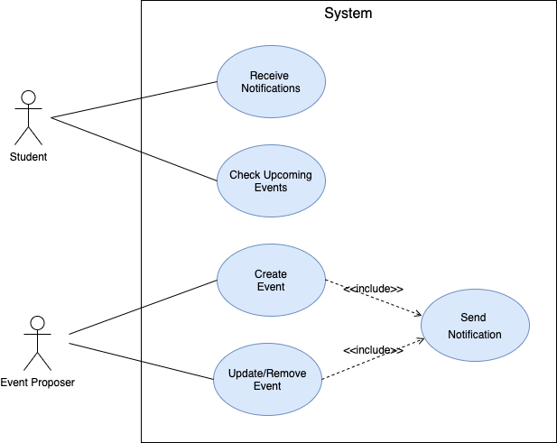
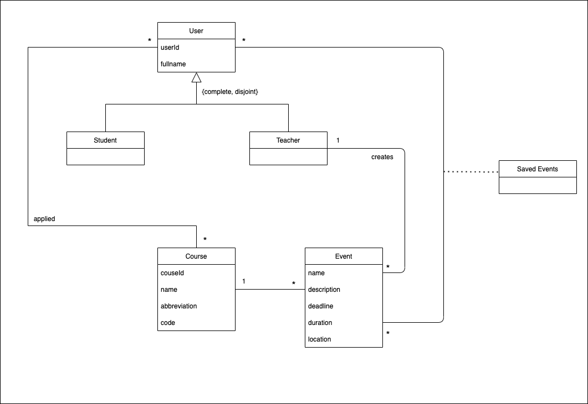
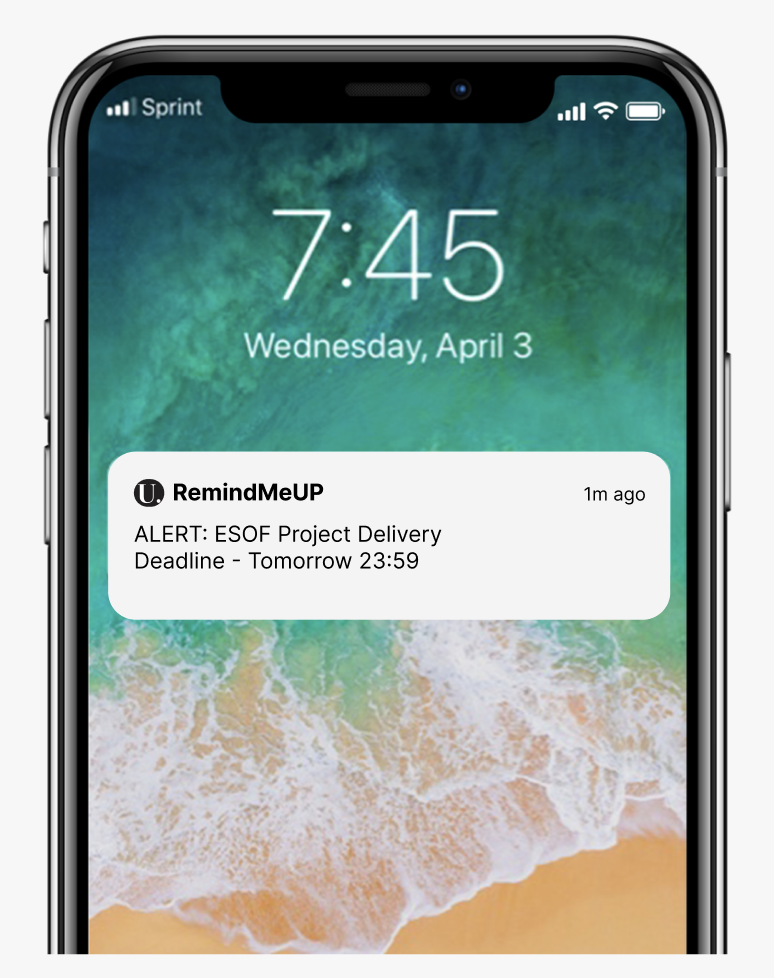
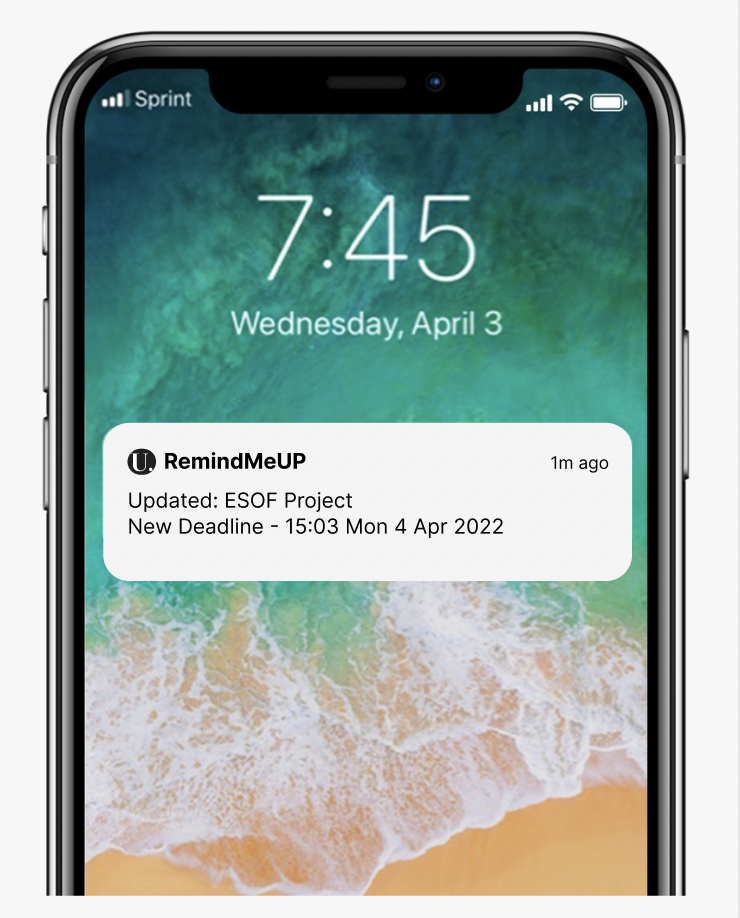
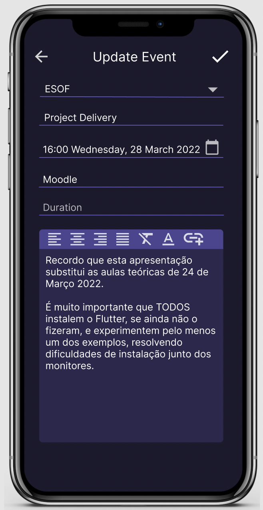
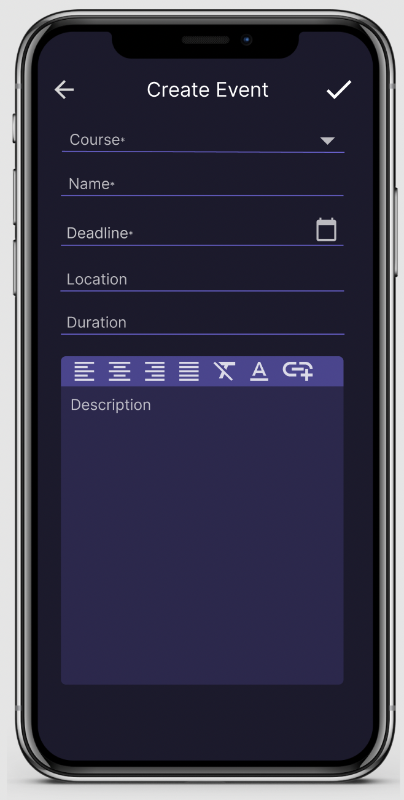
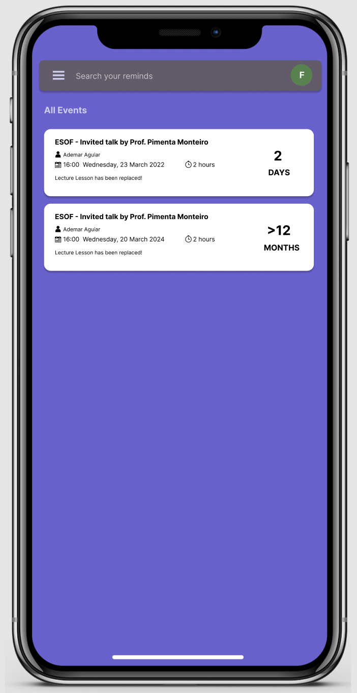
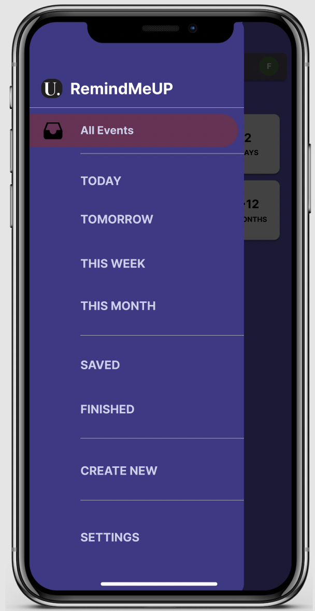
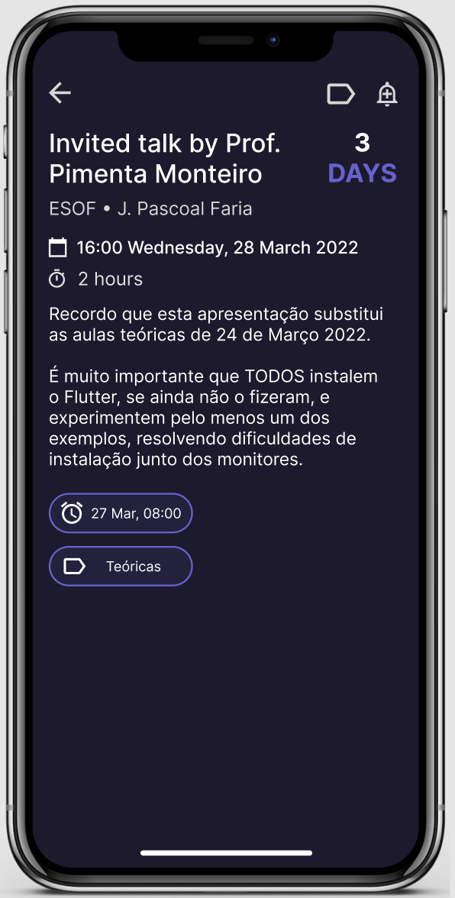
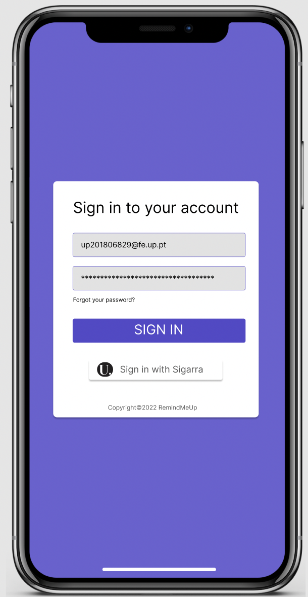

## Requirements

### Use Case Model 

 <p align="center" justify="center">
  
</p>

|||
| --- | --- |
| *Name* | Check upcoming events |
| *Actor* |  FEUP Student |
| *Description* | The student wants to know in an organized manner upcoming tests, exams, assignment deadlines and their details |
| *Preconditions* | - The Student has signed-in into his/her account inside the app |
| *Postconditions* | - The Student finds out all the details of the upcoming events |
| *Normal flow* | 1. The student signs-in with his/her account <br> 2. The student accesses main menu page.<br> 3. The system fetches the data for this student<br> 2. The system shows the list of all upcoming events (ordered by date) <br> 3. The student selects an event to know further details <br> 4. The system shows all the detailed information about this event |
| *Alternative flows and exceptions* | 1. [Unable to Sign-in] If, the student for some reason is unable or does not want to sign-in, manual creation of events can also be done |

|||
| --- | --- |
| *Name* | Receive Notifications |
| *Actor* |  FEUP Student |
| *Description* | The students can receive notications without having to open the application |
| *Preconditions* | - The device which has the application installed, must have internet connection to sync events information<br> |
| *Postconditions* | - The Student gets notified about an event which is coming soon|
| *Normal flow* | 1. The system sends a notification when a new event is added/updated by the event proposer or when an event due date is near <br> 2. The Student receives an alert of the event on all devices that are connected associated with their account |
| *Alternative flows and exceptions* | 1. [No Internet Connection] The app cannot sync the events thus is not able to notify the user <br> 2. [Notification Details] If the Student wants to know further details about the notification, he/she can tap on the notification to automatically enter into the app and redirected to the details of the notification|

|||
| --- | --- |
| *Name* | Create an event |
| *Actor* |  Event Proposer (course teachers) | 
| *Description* |  The event proposer can create an event for a specific course |
| *Preconditions* | - The event proposer must have a teacher role in that specific course<br> |
| *Postconditions* | - The event notification is sent to all students that are applied to that specific course |
| *Normal flow* | 1. The event proposer opens the application and creates an event <br> 2. Details of this event can be added (such as event date, course associated, description, etc...) <br> 3. The event is posted and all the students that are applied to that course will receive a notification (see details on above)|
| *Alternative flows and exceptions* | 1. [Moodle Automatic Update] When an event is added in Moodle of an associated course, this one will also be automatically added to the application, and notification is also sent to the students |

|||
| --- | --- |
| *Name* | Update/remove an event |
| *Actor* |  Event Proposer (course teachers) | 
| *Description* |  The event proposer can update or remove an existing event for a specific course |
| *Preconditions* | - The event proposer must have a teacher role in that specific course<br> |
| *Postconditions* | - A notification is sent to all students that are applied to that specific course|
| *Normal flow* | 1. The event proposer opens the application and selects the event for update or removal <br> 2. A warning is showed before submission of this action and needs to be confirmed <br> 3. The changes are synced to all students interested in this event |
| *Alternative flows and exceptions* | 1. [Moodle Automatic Update] When an event is modified/removed in Moodle of an associated course, this one will also be automatically updated and removed from the application, and notification is also sent to the students |

### Domain Model

To better understand the context of the software system, it is very useful to have a simple UML class diagram with all the key concepts (names, attributes) and relationships involved of the problem domain addressed by your module. 
Also provide a short textual description of each class. 

Example:
 <p align="center" justify="center">
  
</p>

### User Stories

1. As a student, I want to know as soon as possible when
a event was postponed, so that I can reorganize my agenda according
to that change.

2. As a student, I want to know if there is a change in
a event location.

3. As a teacher, I want to be able to reschedule a 
event whenever deemed as necessary also notifying the students.

4. As a teacher, I want to be able to change a event
location whenever deemed as necessary also notifying the students.

5. As an app user, I want to know a more detailed version
of my events in a specific section of the app.

6. As an app user, I want to filter my events in a specific order
according to date.

7. As an app user, I want to filter my events according to a
course.

8. As an app user, I want a template on my sign in, in order 
to make its requirements easy to understand.

9. As an app user, I want to recover my password if I lose it.

## User Story [1]()

As a student, I want to receive deadline reminders for events that I am interested in, so that I won't miss any event.

#### Mockup
 <p align="center" justify="center">
  
</p>

#### Acceptance Test
```gherkin
Given I want to be aware of my deadlines,
When I turn on my phone screen,
Then I can read the notification and know brief information about it.
```

#### Value

Core Function

#### Effort

XL

## User Story [2]()

As a student, I want to know if a teacher made changes to any event I'm interested in, so that I can reorganize my agenda according to the changes.

#### Mockup
 <p align="center" justify="center">
  
</p>

#### Acceptance Test

```gherkin
Given that there was a change in an event and I would like to know as soon as possible,
When I turn on my phone screen,
Then I can read the notification and know a brief detail about the change
```

#### Value

Important for many users 

#### Effort

XL

## User Story [3]()

As a teacher, I want to be able to create an event whenever deemed as necessary and notify the students so that they can take action as soon as possible.

#### Mockup

<p align="center" justify="center">
  
</p>


#### Acceptance Test

```gherkin
Given I want to create an event for the students
When I open the event section
Then I want to fill up the details of an event and post it
```

## User Story [4]()

As a teacher, I want to be able to edit or update an event whenever deemed as necessary and notify the students so that they can be aware as soon as possible.

#### Mockup

<p align="center" justify="center">
  
</p>


#### Acceptance Test

```gherkin
Given that I want to edit or update an event
When I enter the app
Then there should be a form for which I can easily update the details of an event
```

#### Value

Core Function

#### Effort

XL


## User Story [5]()

As an app user, I want to see a preview of all my events, so that I can easily have an idea of all the remaining events.

#### Mockup

<p align="center" justify="center">
  
</p>

#### Acceptance Test

```gherkin
Given I want to see a preview of all my events,
When I head to the main menu,
Then a list of all events should show up
```

#### Value

Core Function

#### Effort

XL

## User Story [6]()

As an app user, I want to apply filter to the events, so that I can find out the events that I am interested in more easily.

#### Mockup

<p align="center" justify="center">
  
</p>

#### Acceptance Test

```gherkin
Given I want to see events of specific deadlines,
When I open the sidebar and choose a time filter,
Then a list of filtered events should show up.
```

#### Value

Core Function

#### Effort

XL

## User Story [7]():

As an app user, I want to see all the detail about an event, so that I can have a better understanding of what the event is about.

#### Mockup

<p align="center" justify="center">
  
</p>

#### Acceptance Test

```gherkin
Given I want to know all the detail about an event,
When I click on an event in a section with events,
Then I should see all the detail of the selected event
```

#### Value

Core Function

#### Effort

XL

## User Story [8]():

As an app user, I want to be able to have an account and sign in, so that I can have all my events synchronized in all the devices.

#### Mockup

<p align="center" justify="center">
  
</p>


#### Acceptance Test

```gherkin
Given I want to have the same content on all devices
When I open the application for the first time
Then a window should appear to log in with my credentials
```

#### Value

Core Function

#### Effort

XL

## User Story [9]():

As an app user, I want to be able to recover my password, so that I can have a new password if I lose it or simply want to change it.

#### Mockup

<p align="center" justify="center">
  
</p>


#### Acceptance Test

```gherkin
Given I want to recover the password,
When I click on 'forgot your password?'
Then a form should show up to recover or change my password
```

#### Value

Core Function

#### Effort

XL
